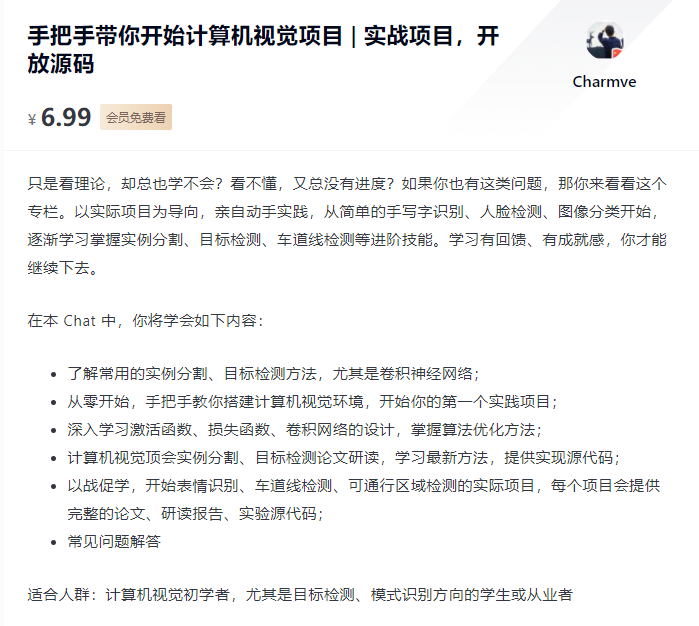

This repository is for the article ["Tutorial: Build a lane detector"(手把手带你开始计算机视觉项目 | 实战项目，开放源码)](https://gitbook.cn/gitchat/activity/5fddbca4201c01667e62c3c4) published on GitChat.


<div align="center">
    
</div>


---

## Updates...

## Set Up
<table>
    <tr>
        <th>
        <td>
            ``detector.py``
        </td>
        <td>
            partition
        </td>
        </th>
    </tr>
    <tr>
        <td>
        <pre>
            <code>
        def do_canny(frame):
            # TODO
            return None
            </code>
        </pre>
        </td>
        <td>
            ``checkpoint2.py``
        </td>
    </tr>
    <tr>
        <td>
            <pre>
            <code>
            def do_segment(frame):
                # TODO
                return None
            </code>
            </pre>
        </td>
        <td>
            ``checkpoint3.py``
        </td>
    </tr>
     <tr>
        <td>
          <pre>
          <code>
            def calculate_lines(frame, lines):
                # TODO
                return None
          </code>
          </pre>
        </td>
        <td>
            ``checkpoin5.py``
        </td>
    </tr>
    <tr>
        <td>
            <pre>
            <code>
            def calculate_coordinates(frame, parameters):
                # TODO
                return None
            </code>
            </pre>
        </td>
        <td>
           ``checkpoin5.py``
        </td>
    </tr>
    <tr>
        <td>
            <pre>
            <code>
            def visualize_lines(frame, lines):
                # TODO
                return None
            </code>
            </pre>
        </td>
        <td>
            ``checkpoint5.py``
        </td>
    </tr>
    <tr>
        <td>
            <pre>
            <code>
                # TODO
                ```
            </code>
            </pre>
        </td>
        <td>
            ``solution.py``
        </td>
    </tr>
</table>


**03/20/2021**</br>
Article published on Gitchat@Gitbook.

<div align="center">
    
</div>
